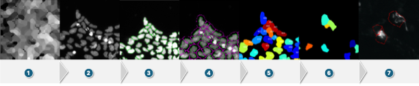

# Compartmentalised Ca²⁺ Imaging Analysis Pipeline

This repository contains the computational analysis tools developed for a Master’s thesis investigating compartment-specific calcium (Ca²⁺) dynamics in human iPSC-derived neural progenitor cells (NPCs). The pipeline enables reproducible, single-cell extraction of mitochondrial, ER, and cytosolic Ca²⁺ signals from live-cell time-lapse imaging experiments.

The workflow combines:
- automated image segmentation and tracking using **CellProfiler**
- quantitative fluorescence extraction
- post-processing, normalisation, and quality control in **Python**

The pipeline is designed to be robust to heterogeneous reporter expression, clustered NPC morphology, and time-lapse–specific challenges such as photobleaching and cell movement.

---

## CellProfiler Analysis Pipelines

This repository contains automated CellProfiler pipelines for segmentation, tracking, and fluorescence quantification in live-cell Ca²⁺ imaging experiments. Two related but distinct pipelines are provided:

- **NPC pipeline** – optimised for iPSC-derived neural progenitor cells
- **Fib pipeline** – adapted for fibroblasts with larger size and extended cytoplasmic morphology

Both pipelines follow the same overall analysis logic but differ in how cellular regions of interest (ROIs) are defined and related to nuclei.

---

## Conceptual Overview of the Pipeline

**Figure 1. Conceptual overview of the CellProfiler analysis workflow.**  
The figure summarises the logical flow of the pipeline: background correction, nucleus detection, ROI definition, tracking, identification of reporter-positive cells, and visual quality control.  
Note that this illustration represents a **conceptual summary**; the actual CellProfiler pipelines consist of multiple modules described in detail below.

---

## General Design Principles

The pipelines are designed to:

- use **nuclei as stable reference objects** for segmentation and tracking
- avoid unreliable full-cell segmentation based solely on reporter intensity
- define **standardised, reproducible ROIs** suitable for time-lapse analysis
- enable **single-cell Ca²⁺ trace extraction** across frames
- restrict analysis to **reporter-positive cells** using objective intensity criteria

All measurements are exported as tabular data for downstream analysis in Python.

---

## NPC vs Fib Pipeline: Key Conceptual Difference

Neural progenitor cells (NPCs) are small, compact, and densely packed. For these cells, a nucleus-centred ROI provides a robust approximation of whole-cell signal.

Fibroblasts, in contrast:
- are substantially larger,
- display irregular and extended cytoplasmic morphology,
- often exhibit reporter signal far from the nucleus.

Therefore, the Fib pipeline does **not** rely on nucleus expansion alone. Instead, it explicitly segments cellular regions in a reporter channel and then **relates those objects to nuclei**. This distinction is critical for correct signal attribution.

---

## Full CellProfiler Module Documentation (Execution Order)

The table below lists **all CellProfiler modules in execution order**, with explicit comparison between the NPC and Fib pipelines.

| Module | NPC Pipeline | Fibroblast Pipeline | Purpose and Rationale |
|------|-------------|--------------|-----------------------|
| **CorrectIlluminationCalculate (Illum_mt)** | ✔ | ✔ | Generates an illumination correction image for the mitochondrial channel, capturing large-scale intensity variations caused by uneven illumination or optical artefacts. |
| **CorrectIlluminationCalculate (Illum_GECI)** | ✔ | ✔ | Computes a channel-specific illumination correction for the cytosolic or ER GECI channel to preserve compartment-specific signal structure. |
| **CorrectIlluminationApply** | ✔ | ✔ | Applies illumination correction by dividing raw images by the calculated illumination model, normalising background intensity across the field of view. |
| **RescaleIntensity (Hoechst)** | ✔ | ✔ | Normalises Hoechst intensity to enhance nucleus–background contrast and stabilise segmentation across experiments. |
| **IdentifyPrimaryObjects (Nuclei)** | ✔ | ✔ | Segments nuclei using intensity thresholding and empirically defined size constraints. Nuclei serve as stable reference objects for tracking and ROI association. |
| **IdentifyPrimaryObjects (CellBody / Reporter Channel)** | ✖ | ✔ | **Fib pipeline only.** Segments cellular regions directly from a reporter channel to capture extended fibroblast morphology that cannot be approximated by nucleus expansion. |
| **IdentifySecondaryObjects (CellDisk)** | ✔ | ✖ | **NPC pipeline only.** Expands each nucleus by a fixed radius to generate a standardised whole-cell ROI (“CellDisk”), suitable for compact NPC morphology. |
| **RelateObjects (Nuclei ↔ CellBody)** | ✖ | ✔ | **Fib pipeline only.** Relates reporter-defined cellular objects to their corresponding nuclei, enabling per-cell tracking and quantification. |
| **IdentifyTertiaryObjects (CytoRing)** | optional | ✔ | Subtracts the nuclear region from the CellDisk to create a perinuclear cytoplasmic ROI (“CytoRing”). Used mainly in the NPC pipeline; less central for fibroblasts. |
| **TrackObjects (Nuclei)** | ✔ | ✔ | Tracks nuclei across consecutive frames to generate persistent TrackIDs. Associated cellular ROIs inherit tracking via nucleus linkage. |
| **MeasureObjectIntensity** | ✔ | ✔ | Quantifies mean fluorescence intensity within defined ROIs for each tracked cell and time point. |
| **FilterObjects (PositiveCells_mt)** | ✔ | ✔ | Removes cells with mitochondrial reporter intensities below a defined threshold, retaining reporter-positive cells only. |
| **FilterObjects (PositiveCells_other)** | ✔ | ✔ | Applies equivalent intensity-based filtering for cytosolic or ER reporter channels. |
| **OverlayOutlines** | ✔ | ✔ | Overlays outlines of nuclei and cellular ROIs onto the original images for visual quality control. |
| **SaveImages (QC overlays)** | ✔ | ✔ | Saves overlay images for segmentation and filtering validation. |
| **ExportToSpreadsheet** | ✔ | ✔ | Exports all quantified measurements, object identifiers, tracking information, and metadata to CSV files for downstream analysis. |

---

## Summary of Pipeline Strategies

**NPC pipeline**
- Single primary object: nuclei
- Whole-cell ROIs generated by nucleus expansion
- Optimised for small, densely packed cells

**Fib pipeline**
- Two primary object classes: nuclei and reporter-defined cell bodies
- Explicit nucleus–cell association using `RelateObjects`
- Required to capture extended cytoplasmic signal

---

## Pipeline Outputs

Each pipeline produces:
- CSV files containing object-level intensity measurements
- tracking identifiers (TrackID)
- frame numbers and metadata
- reporter-positive cell classifications
- optional QC images with ROI overlays

These outputs are designed to be consumed directly by the Python analysis scripts included in this repository.

---

## Adapting the Pipelines to New Cell Types

- Use the **NPC strategy** for compact, nucleus-centred cells
- Use the **Fib strategy** when cytoplasmic extent cannot be approximated by nucleus expansion
- Preserve nucleus-based tracking whenever possible to maintain temporal stability

---

## Post-Processing in Python

Exported CellProfiler tables are processed using custom Python scripts to:
- merge tracking and intensity data,
- restrict analysis to cells present across the full time series,
- normalise fluorescence traces (F/F₀),
- correct for photobleaching,
- generate single-cell and population-level Ca²⁺ traces.

These steps are described in detail in the accompanying analysis scripts.

---

## Requirements

- CellProfiler ≥ 4.2
- Python ≥ 3.10
- Python packages: `numpy`, `pandas`, `matplotlib`

---

## Contact

Author: **Felicitas Windhagen**  
For questions regarding pipeline usage or adaptation, please open an issue or contact the author.
